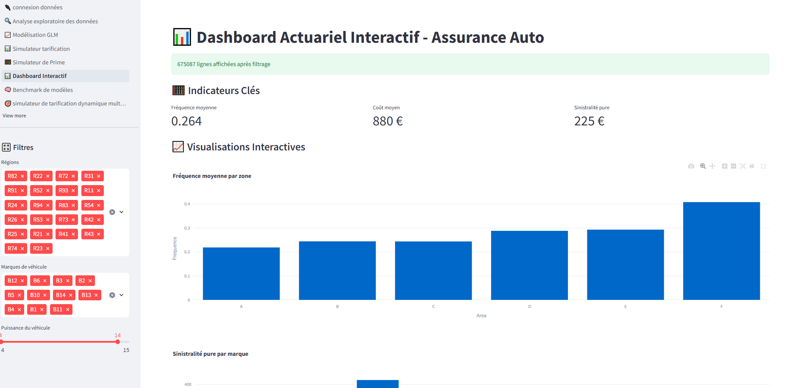
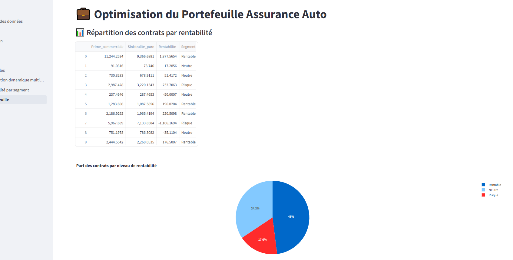
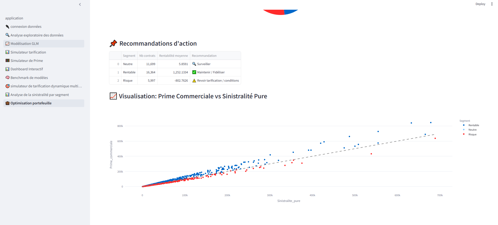

# 🚗 Application Actuarielle - Assurance Automobile

Une application professionnelle Streamlit pour explorer, modéliser et optimiser un portefeuille d'assurance auto. Conçue pour mettre en valeur des compétences en actuariat, data science et visualisation interactive.

## 🔍 Fonctionnalités principales

| Page | Description |
|------|-------------|
| **Accueil** | Introduction à l'actuariat non-vie & assurance auto |
| **Connexion aux données** | Import CSV / Excel / PostgreSQL / MySQL / MongoDB + enrichissement `ClaimAmount` |
| **Description des données** | EDA complet : statistiques, types, valeurs manquantes, valeurs uniques |
| **Modélisation GLM** | GLM Fréquence (Poisson) & Coût moyen (Gamma) + prime pure |
| **Simulateur de prime** | Interface dynamique pour tester plusieurs profils assurés |
| **Benchmark modèles** | Comparaison GLM vs Random Forest avec scores MAE, RMSE, R² |
| **Analyse sinistralité** | Heatmap + détection segments à risque |
| **Optimisation portefeuille** | Analyse de rentabilité + recommandations d'action |
| **Dashboard + PDF** | Visualisations + export automatique du rapport PDF |
| **Tarification multi-profils** | Comparaison de profils personnalisés sur les résultats GLM |

---

## 📷 Captures d'écran

### Dashboard interactif



### Optimisation portefeuille



---
## 🎥 Démo vidéo de l'application

Découvrez le fonctionnement de l’application en action :  
[](https://youtu.be/7qu-5upbrI8)

> 🔗 https://youtu.be/7qu-5upbrI8

---

## 🛠 Installation & Exécution

```bash
# 1. Cloner le repo
git clone https://github.com/berradiginamic/assurance-auto-actuariat.git
cd assurance-auto-actuariat

# 2. Installer les dépendances
pip install -r requirements.txt

# 3. Lancer l'application
streamlit run application.py
```

---

## 📁 Structure du projet

```bash
.
├── application.py                     # Page principale Streamlit
├── pages/                    # Pages de navigation
│   ├── 1_🔌_connexion_données.py
    ├── 2_🔍_Analyse_exploratoire_des_données.py
    ├── 3_📈_Modélisation_GLM.py
│   ├── 4_📊_Simulateur_tarification.py
│   ├── 5_🧮_Simulateur_de_Prime.py
│   ├── 6_📊_Dashboard_Interactif.py
│   ├── 7_🧠_Benchmark_de_modèles.py
│   ├── 8_🎯_simulateur_de_tarification_dynamique_multi_profils.py
    ├── 9_📊_Analyse_de_la_sinistralité_par_segment.py
    └── 10_💼_Optimisation_portefeuille.py
├── images/                   # Logos, graphiques et captures
├── requirements.txt
└── README.md
```

---


## 🧠 Auteure

👩‍💻 **Berrabah Fatima**  
Docteure en Mathématiques, Data Scientist & Développeuse Full Stack Big Data  


---

## 📬 Contact

📧 berrabahfatima1982@gmail.com  
💼 En recherche active d'opportunités en Actuariat / Data Science
